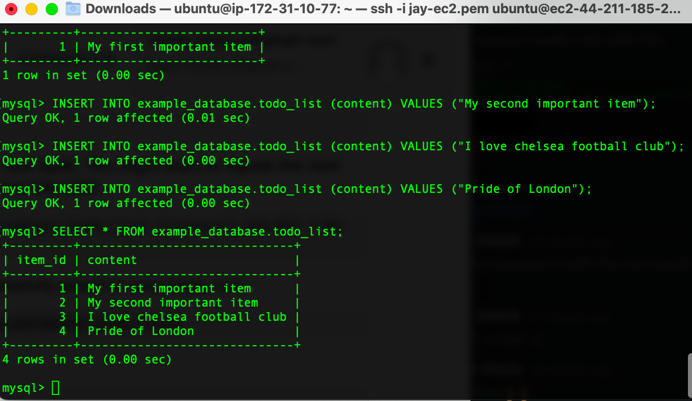
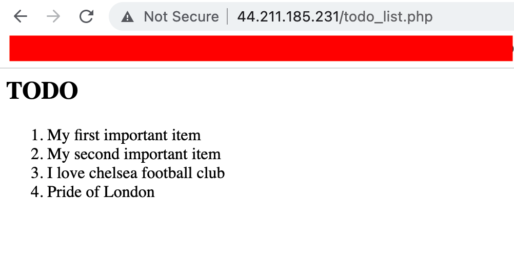

## Project_2

---
---
### The following steps was carried out to setup a LEMP satck

* ## Step 1
    * Installation of of NGNIX
* 

* Successfully bringing nginx service up   with the following code block
*   
* Successful curl showing that we can access our web locally also via the web browser
*     
*   
* ## Step 2
    * Install mysql server with password set up
    *   
    *   
* ## Step 3
    * Install PHP
<html>
    <head>
    
    sudo apt install php-fpm php-mysql
</html>

* ## Step 4
    * Configuring Nginx to use PHP processor

<html>
    <head>
    
    sudo mkdir /var/www/projectLEMP
</html>
<html>
    <head>
    
    sudo chown -R $USER:$USER /var/www/projectLEMP
</html>
<html>
    <head>
    
    sudo nano /etc/nginx/sites-available/projectLEMP
</html>

*    
 

*   

* ## Step 5
* Testing PHP with Nginx

<html>
    <head>

    sudo nano /var/www/projectLEMP/info.php

</html>
<html>
    <head>
    
    <?php
    phpinfo();
</html>
<html>
    <head>
    
    http://`server_domain_or_IP`/info.php

</html>
 
 * Details shwoing websever displayed

    *   

* ## Step 6

    * RETRIEVING DATA FROM MYSQL DATABASE WITH PHP

* The following screenshot shows a successful data todo data retrieval
    *   

    *   

    *   
