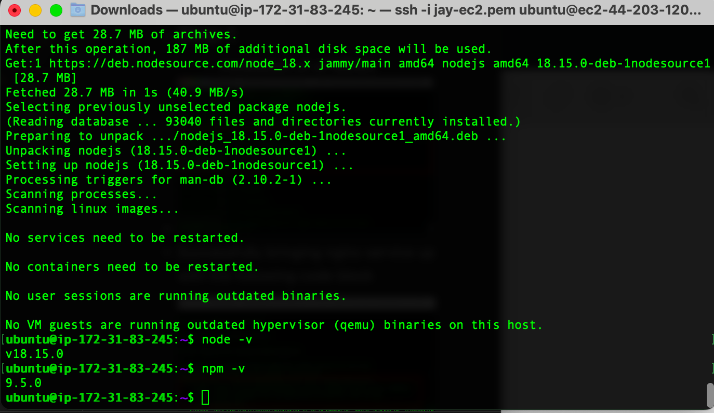
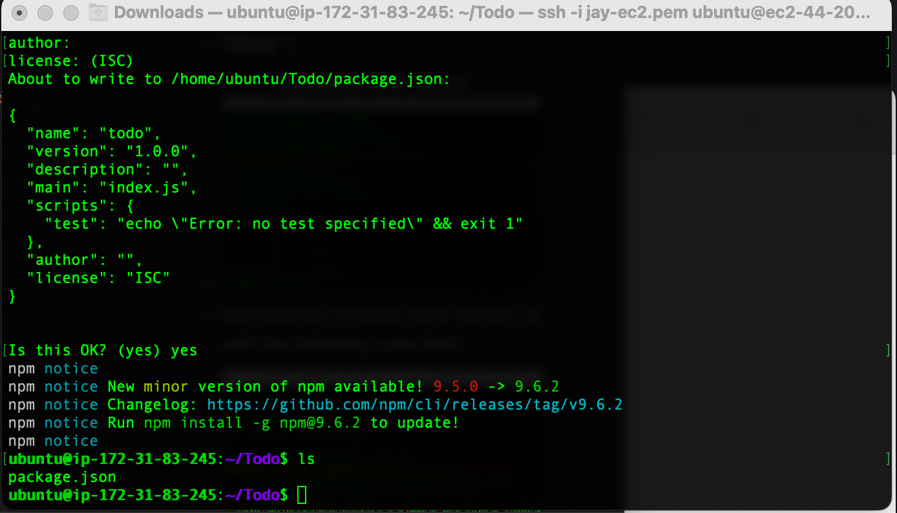
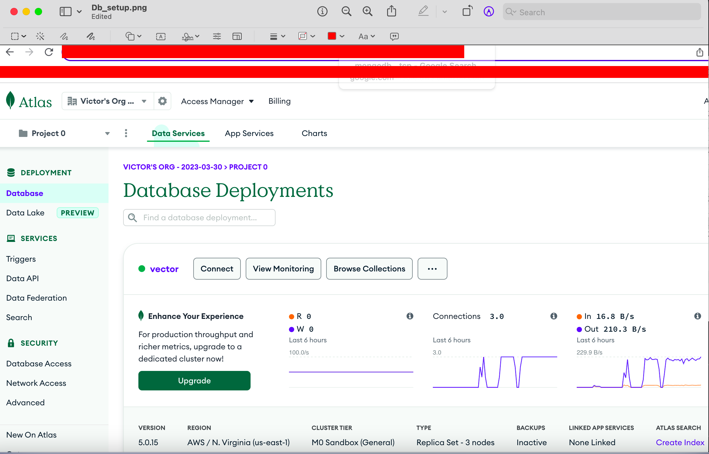
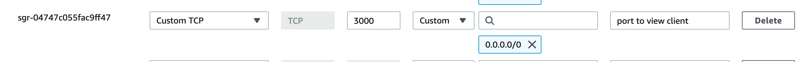
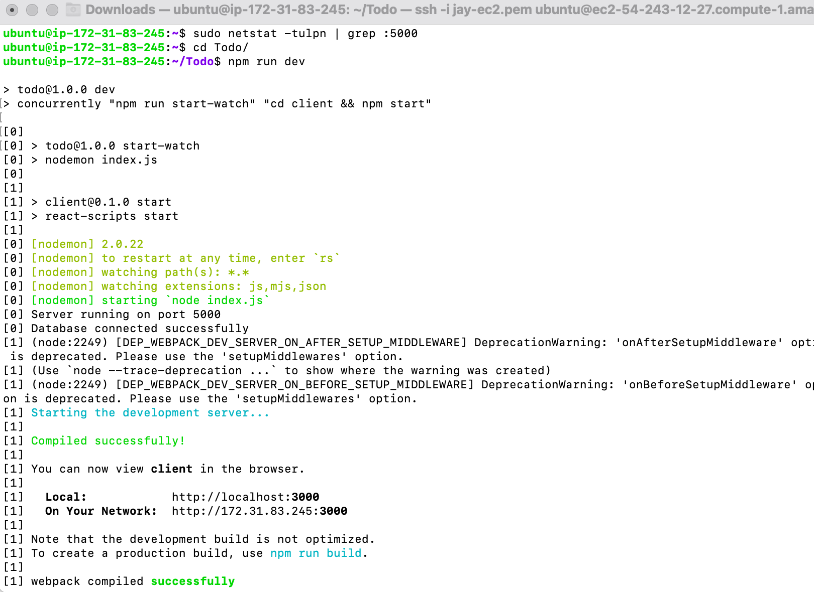
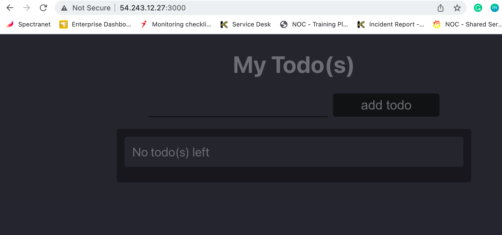

## Steps taking to achieve the inplimentation of MERN stack

---
---
* Insallation of of npm node

* 

* Initializing Npm

* 

* DB configuration

* 

* Created port permission port:3000 for the application to listen on

* 

* DB and Client connected successfully

* 

* Lastly we can see this running successfully on the web

* 