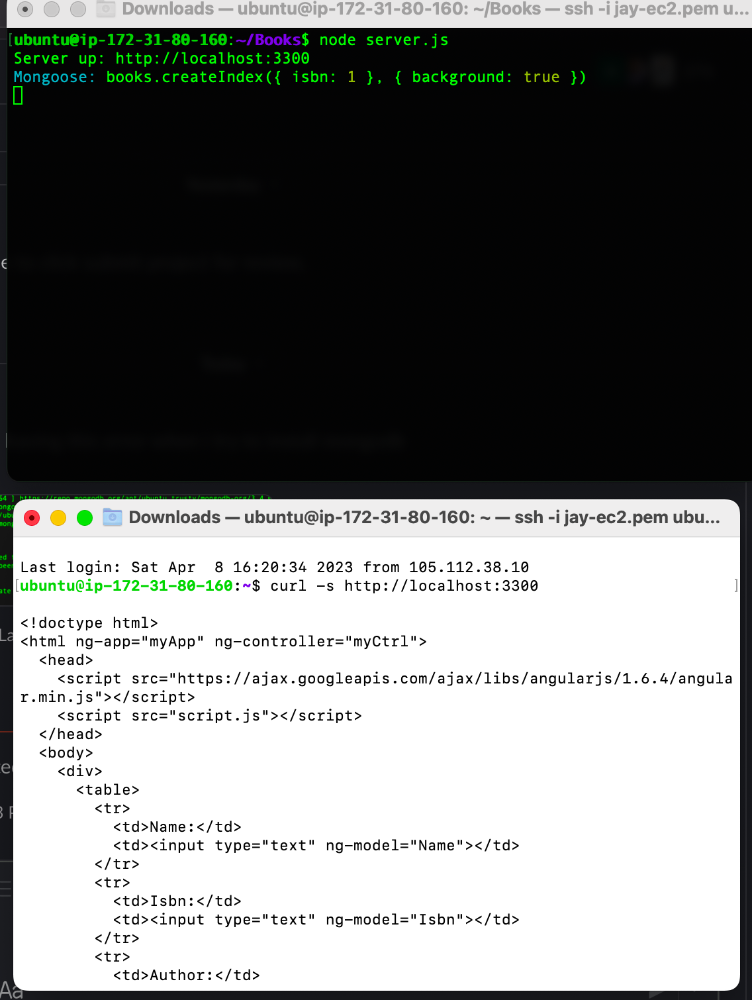
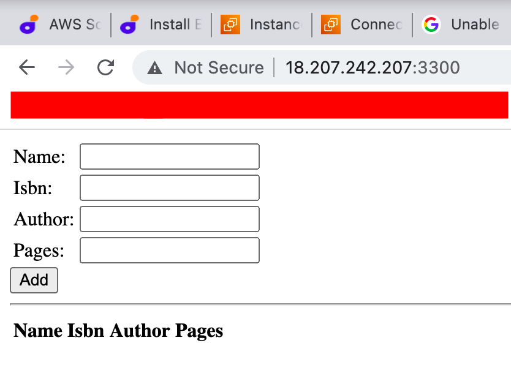

## Project 4 MEAN STACK
---
---
* Started with setting up a new Ubuntu server 20.04.

* Installation of mogoDB and other dependencies e.g nojejs also npm package which powers nodejs to run.

* Created a couple of directories and files wher like like of the inde.html, router.js and server.js here the port was difined which was then open on AWS from our inbound rule.

The folling screenshot shows a successful outcome of MEAN STACK deployment.

 

