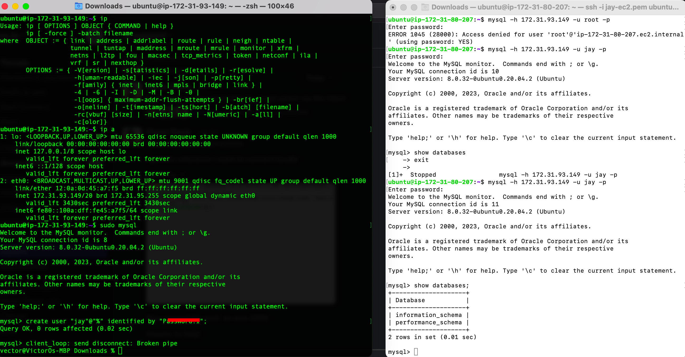

## Project 5 Server/Client connection

---
---
* Couple of steps taken to achieve this project.

*1* Spinned up to Ec2 ubuntu insgtances.  

*2* Installed mysql-server and mysql-client respectively on the instances spinned up. 

*3* The following command was initiated to edit the file to allow only local connection

<html>
    <head>
    
    /etc/mysql/mysql.conf.d/mysqld.cnf
</html>
<html>
    <head>
    
    bind-address to 0.0.0.0
</html>

*4* From the Server we created a user which the client will use to connect to the server locally.

*5* From the Client end we connected to the Server with the cobination of the Server IP and the user created on the Server.

 

