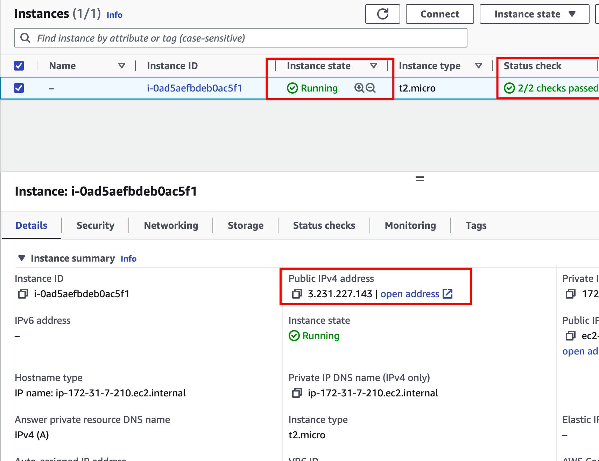
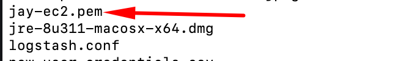
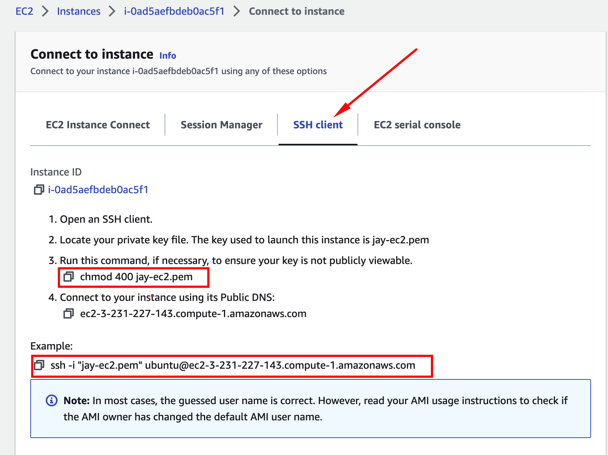
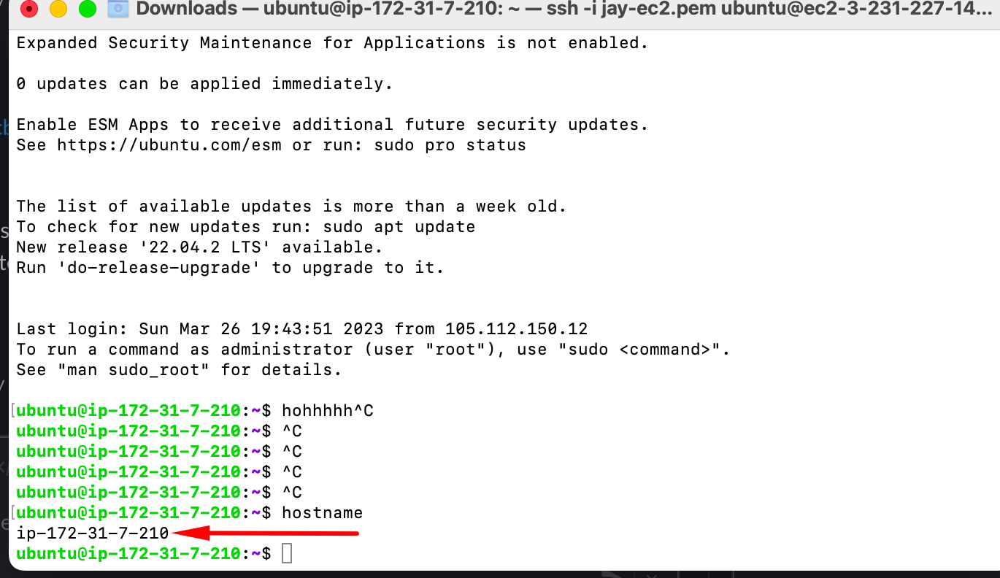

# MasterClass_Devops
<!---- Headings make use of the pound key-->
### _These are the following steps taking to achieve project_1_

<!--- To make word look italic use  * or _ around the word-->

---
---

<!--- Ul-->

* Register and set up AWS account

* Setting up Ec2 instance and in running state

* Image also showing public IP which will enable me   access the maching via SSH

* 

* Next i was able to generate the SSH and the key combination to make the connection successful through SSH
* 

* CHOM was initiated to change permission and as well.
* 

* Lastly a screenhot showing a successful SSH to the AWS Ubuntu machine.

* 