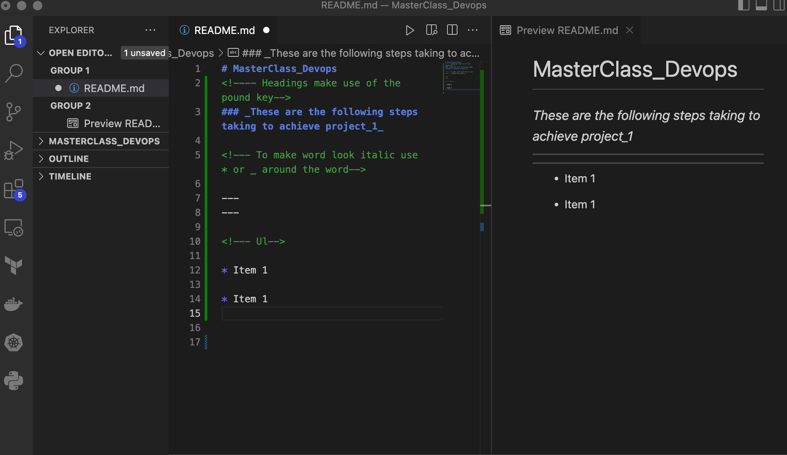

# MasterClass_Devops
<!---- Headings make use of the pound key-->
### _These are the following steps taking to achieve project_1_

<!--- To make word look italic use  * or _ around the word-->

---
---

<!--- Ul-->

* Register and set up AWS account

* Setting up Ec2 instance and connecting to it 

<!-- Image tag -->

