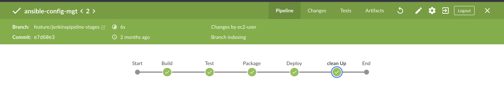

# Project 14
---
*The following steps and screenshot will show how project 14 was achieved. Poject 14 is mainly automation based using Ansible to deploy and set up resources*
  
  - Screenshot below show the following
  a. My repository
  b. Shows each of the config files needed to complete this tasks

- Screenshot2

c. This shows the config for site.yml which the playbook pick to trigger an action when we un comment

- Screenshot3

d. This shows the repo created on Jenkins

- Screenshot4 

e. This shows different pipeline stages with the Jenkins file

*One of the task also stated we run a pipeline starting from the build- -> test -> package -> deploy*

- Screenshot5
  
  
  f. This shows success from the build stage to cleanup

- Screenshot6
  
  
  g. Yaml configuration for DB setup
